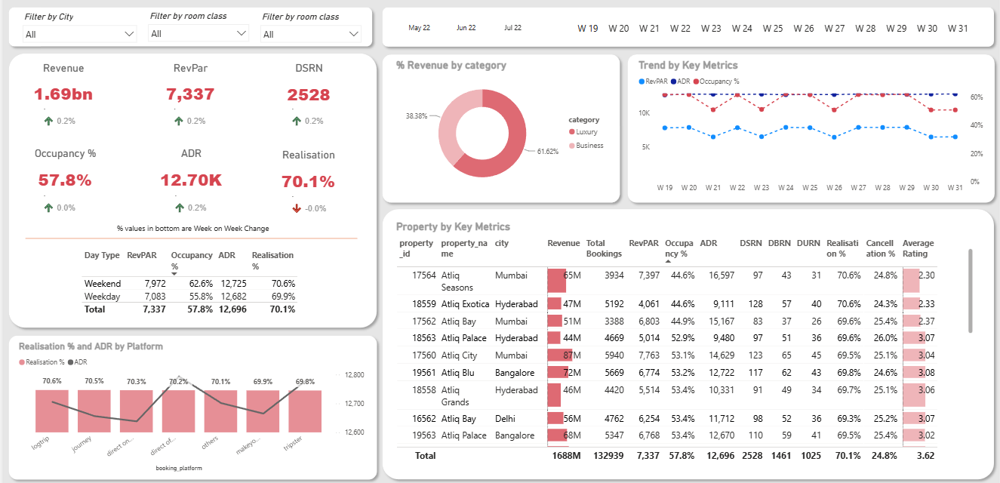

# 🏨 Hotel Chain Performance Dashboard

> A guided Power BI case study on hospitality analytics independently implemented end-to-end including data modelling, Power Query transformations, DAX measures, and dashboard design.

---

## 📌 Overview

This project follows a structured hospitality analytics case study to build a performance dashboard for a hotel chain operating across multiple cities. While the business problem and dataset were provided as part of the case study, all implementation Power Query transformations, star schema modelling, DAX measures, and visual design was done independently.

The goal: give revenue and operations teams a single view of property performance, pricing efficiency, and booking trends.

---

## 🖼️ Dashboard Preview



---

## 📊 Dashboard KPIs

| KPI | Description |
|---|---|
| **RevPAR** | Revenue Per Available Room — core profitability metric |
| **ADR** | Average Daily Rate — pricing performance across properties |
| **Occupancy Rate** | % of available rooms occupied per period |
| **Weekend vs Weekday** | Performance split to identify demand pattern differences |
| **WoW Growth** | Week-over-Week change across all major metrics |
| **Property Benchmarking** | Cross-property comparison to surface best and worst performers |

---

## 📋 Dashboard Features

- **Multi-property Overview** — single view across all hotel properties with drill-down capability
- **Revenue Trend Analysis** — time series of RevPAR and ADR to surface seasonality and pricing opportunities
- **Weekend vs Weekday Split** — side-by-side comparison to guide dynamic pricing decisions
- **Week-over-Week Growth Tracking** — WoW % change across RevPAR, ADR, and occupancy
- **Property Benchmarking** — rank properties by KPI to identify top and underperformers
- **Interactive Slicers** — filter by property, date range, room category, and booking channel

---

## 🗂️ Data Model

Star schema with the following tables:

| Table | Description |
|---|---|
| `fact_bookings` | Individual booking transactions |
| `fact_aggregated_bookings` | Aggregated booking metrics |
| `dim_hotels` | Property details and city mapping |
| `dim_rooms` | Room category definitions |
| `dim_date` | Calendar table for time intelligence |

---

## 🛠️ Technical Approach

**Data Preparation (Power Query):**
- Consolidated multi-property booking data into a unified fact table
- Built and linked a calendar dimension for accurate time intelligence DAX
- Standardised property names, room types, and booking channel labels
- Computed derived fields: available room-nights, occupied room-nights, revenue per property

**DAX Measures (sample):**
```dax
RevPAR = DIVIDE([Total Revenue], [Total Available Rooms])

ADR = DIVIDE([Total Revenue], [Total Occupied Rooms])

Occupancy Rate = DIVIDE([Total Occupied Rooms], [Total Available Rooms])

WoW RevPAR Growth =
VAR CurrentWeek = [RevPAR]
VAR PreviousWeek =
    CALCULATE([RevPAR], DATEADD('Date'[Date], -7, DAY))
RETURN
DIVIDE(CurrentWeek - PreviousWeek, PreviousWeek)
```

---

## ⚙️ Setup & Usage

1. Clone or download this repo
2. Navigate through the `data/` folder — it contains all required Excel files (`dim_date.xlsx`, `dim_hotels.xlsx`, `dim_rooms.xlsx`, `fact_bookings.xlsx`, `fact_aggregated_bookings.xlsx`). Familiarise yourself with each table before opening the dashboard
3. Open `hotel_chain_dashboard.pbix` in **Power BI Desktop** (free from Microsoft)
4. When prompted, update the data source paths to point to each Excel file in your local `data/` folder
5. Once all sources are connected, refresh the data model and use slicers to filter by property, city, date range, or room type

---

## 🔍 Limitations & Future Work

- **Forecasting layer**: Adding demand forecasting (Prophet or ARIMA) would shift this from reporting to planning
- **Real-time integration**: Connecting to a live PMS data feed would make this operationally usable
- **Guest satisfaction**: Integrating review scores alongside revenue KPIs would give a fuller picture of property health

---

## 🛠️ Tech Stack


---

## 📄 License

This project is open-source under the [MIT License](LICENSE).
